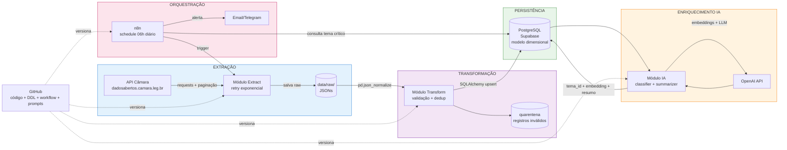
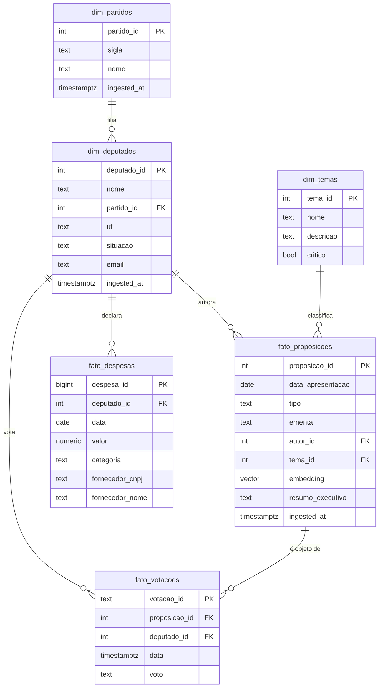

# PRD — Bússola Pública
### Pipeline de Inteligência Legislativa com IA Generativa

| Campo | Valor |
|---|---|
| **Documento** | Product Requirements Document (PRD) |
| **Versão** | 1.0 |
| **Status** | Draft → Approved |
| **Data** | 15/Mai/2026 |
| **Janela de Entrega** | 13/Mai/2026 → 15/Jun/2026 |
| **Tipo de Produto** | Pipeline de dados B2B com camada de IA |
| **Fonte Primária** | API Câmara dos Deputados (`dadosabertos.camara.leg.br`) |

---

## 📑 Sumário

1. [Visão Geral](#1-visão-geral)
2. [Objetivos e Métricas de Sucesso](#2-objetivos-e-métricas-de-sucesso)
3. [Personas e Stakeholders](#3-personas-e-stakeholders)
4. [Escopo](#4-escopo)
5. [Casos de Uso](#5-casos-de-uso)
6. [Requisitos Funcionais](#6-requisitos-funcionais)
7. [Requisitos Não-Funcionais](#7-requisitos-não-funcionais)
8. [Arquitetura Técnica](#8-arquitetura-técnica)
9. [Modelo de Dados](#9-modelo-de-dados)
10. [Camada de Inteligência Artificial](#10-camada-de-inteligência-artificial)
11. [Orquestração e Operação](#11-orquestração-e-operação)
12. [Qualidade, Versionamento e Segurança](#12-qualidade-versionamento-e-segurança)
13. [Decisões Arquiteturais (ADRs)](#13-decisões-arquiteturais-adrs)
14. [Riscos e Mitigações](#14-riscos-e-mitigações)
15. [Entregáveis e Critérios de Aceitação](#15-entregáveis-e-critérios-de-aceitação)
16. [Marcos de Produto](#16-marcos-de-produto)
17. [Roadmap Futuro (Pós-V1)](#17-roadmap-futuro-pós-v1)
18. [Anexos e Referências](#18-anexos-e-referências)

---

## 1. Visão Geral

### 1.1 Resumo Executivo

A **Bússola Pública** é uma consultoria fictícia de inteligência legislativa que comercializa relatórios sobre a atividade da Câmara dos Deputados a clientes corporativos (escritórios de advocacia, áreas de Relações Governamentais, associações setoriais e empresas reguladas). Hoje a operação é manual, dependente de leitura humana do portal da Câmara, sem base de dados, sem histórico e sem padronização temática.

Este PRD descreve a **V1 do produto interno** que substituirá esse trabalho manual por um pipeline automatizado de extração, transformação, enriquecimento com IA e orquestração de alertas — entregando à equipe analítica uma base íntegra, classificada e atualizada diariamente.

### 1.2 Contexto do Negócio

A API de Dados Abertos da Câmara dos Deputados expõe diariamente, de forma pública e gratuita, todo o fluxo de proposições, votações, despesas e cadastro parlamentar. Esses dados — embora públicos — não chegam ao mercado em formato consumível: estão em endpoints REST paginados, sem classificação semântica, sem histórico consolidado e sem capacidade de alerta. Consultorias de Relações Governamentais cobram cinco dígitos mensais por relatórios construídos manualmente sobre essa mesma base.

### 1.3 Problema

A operação atual da Bússola Pública sofre de cinco gargalos estruturais:

| ID | Gargalo | Impacto |
|---|---|---|
| P1 | Inexistência de base de dados centralizada — analistas trabalham em planilhas pessoais | Sem reuso de trabalho prévio, sem auditoria, sem histórico |
| P2 | Classificação temática inconsistente entre analistas | Relatórios incomparáveis ao longo do tempo |
| P3 | Alertas dependem da memória do analista | Cliente é pego desprevenido por pautas relevantes |
| P4 | Nenhum indicador operacional é medido | Não se sabe volume, velocidade nem distribuição temática |
| P5 | Custo operacional cresce linearmente com número de clientes | Modelo de negócio não escala |

### 1.4 Proposta de Valor

> **Transformar dado público em sinal acionável, sem trabalho humano repetitivo.**

A V1 entrega à Bússola Pública uma plataforma interna que:

- Captura **automaticamente** o fluxo legislativo diário
- **Padroniza** a classificação temática via IA
- **Persiste** histórico consultável em SQL
- **Alerta** sobre proposições de temas críticos sem intervenção humana
- **Mede** volume, partidos mais ativos, deputados mais produtivos, despesas declaradas

### 1.5 Glossário

| Termo | Definição |
|---|---|
| **Proposição** | Qualquer matéria em tramitação na Câmara (Projeto de Lei, PEC, Requerimento, etc.) |
| **Ementa** | Resumo oficial e curto de uma proposição |
| **Votação** | Evento em que deputados se manifestam sobre uma proposição (sim, não, abstenção, obstrução) |
| **Despesa** | Gasto declarado por deputado via cota parlamentar (CEAP) |
| **Tema** | Categoria semântica atribuída a uma proposição (ex.: Saúde, Tributário) |
| **Embedding** | Representação vetorial de um texto em espaço de alta dimensão |
| **Pipeline** | Sequência automatizada de etapas Extract → Transform → Load → Enrich |
| **ETL** | Extract, Transform, Load — paradigma clássico de movimentação de dados |
| **LLM** | Large Language Model (ex.: GPT-4o, GPT-4o-mini) |
| **DoD** | Definition of Done — critérios objetivos de pronto |
| **ADR** | Architecture Decision Record — registro de decisão técnica |

---

## 2. Objetivos e Métricas de Sucesso

### 2.1 Objetivos do Produto (SMART)

| ID | Objetivo | Métrica | Meta |
|---|---|---|---|
| O1 | Eliminar coleta manual da operação | % de relatórios alimentados por base automatizada | 100% |
| O2 | Padronizar a classificação temática | % de proposições com tema atribuído | ≥ 95% |
| O3 | Reduzir tempo entre publicação e disponibilidade | Latência de ingestão | < 24h |
| O4 | Habilitar análise histórica | Janela mínima de dados no banco | ≥ 30 dias |
| O5 | Antecipar pautas críticas | Disparo de alerta após detecção | < 15 min |
| O6 | Operar com custo previsível | Custo OpenAI mensal | < US$ 10 |

### 2.2 KPIs Operacionais

| KPI | Definição | Meta V1 |
|---|---|---|
| **Taxa de Execução Bem-Sucedida** | Execuções diárias completas / Execuções agendadas em 7 dias | ≥ 95% |
| **Latência E2E** | Tempo da execução incremental diária | < 10 min |
| **Cobertura de Dados** | Dias de histórico ingerido até a entrega | ≥ 30 |
| **Acurácia de Classificação** | Sample validado manualmente (n=50) | ≥ 80% |
| **Custo de IA** | Total mensal gasto em OpenAI | ≤ US$ 10 |
| **Idempotência** | Reexecução do pipeline gera duplicatas? | 0 duplicatas |

### 2.3 Não-Objetivos (V1 explicitamente NÃO entrega)

- ❌ Interface web/dashboard para usuário final (uso direto via SQL e tabelas do Supabase)
- ❌ Integração com Senado, TSE ou outros legislativos
- ❌ Análise de sentimento de discursos parlamentares
- ❌ Predição de resultado de votação
- ❌ Multi-tenant (separação por cliente)
- ❌ Backfill histórico anterior à data de entrada em produção
- ❌ Camada de API REST exposta para clientes externos
- ❌ SLA contratual de disponibilidade

---

## 3. Personas e Stakeholders

### 3.1 Persona Primária — Analista de Inteligência Legislativa

- **Quem é:** profissional da Bússola Pública responsável por monitorar a Câmara e produzir relatórios semanais para clientes
- **Dor atual:** lê o portal da Câmara manualmente, não tem histórico, esquece de pautas críticas, classifica temas de forma diferente toda semana
- **O que espera do produto:** abrir o Supabase, executar um SELECT, exportar a lista de proposições da semana já classificadas e resumidas, sem ter que abrir um único endpoint da API na mão

### 3.2 Persona Secundária — Cliente Corporativo da Bússola Pública

- **Quem é:** Head de Relações Governamentais de uma empresa regulada (ex.: telecom, financeiro, saúde)
- **Dor atual:** descobre tarde demais quando uma PL ameaça seu setor
- **O que espera (indireto):** o alerta automático do n8n garante que seu setor sensível dispara notificação minutos após a proposição ser publicada

### 3.3 Stakeholder Patrocinador — CEO Fictício da Bússola Pública

- **Mandato:** "Não escala. Quero um pipeline automatizado que pegue tudo o que importa, classifique por tema usando IA e me entregue isso pronto para virar produto."
- **Critério de sucesso pessoal:** poder demitir o trabalho repetitivo dos analistas e realocá-los para análise de alto nível e atendimento a cliente

### 3.4 Stakeholder Acadêmico — Banca Avaliadora

- **Mandato:** validar competências da Fase 1 (Python, Pandas, SQL, Git, n8n, IA Generativa) aplicadas a problema real
- **Critério:** funcionamento, modelagem, IA aplicada, automação, comunicação

---

## 4. Escopo

### 4.1 Em Escopo (V1)

| Área | Item |
|---|---|
| Ingestão | Endpoints `/deputados`, `/proposicoes`, `/votacoes`, `/partidos`, `/deputados/{id}/despesas` |
| Janela | Mínimo 30 dias corridos antes da data de entrega |
| Armazenamento bruto | JSONs persistidos em filesystem local |
| Armazenamento analítico | PostgreSQL gerenciado (Supabase ou equivalente) |
| Modelagem | Esquema dimensional (fato + dimensão) |
| IA — Classificação | Classificação temática automática via embeddings (Caminho A do briefing) |
| IA — Resumo | Resumo executivo de 3 linhas via LLM (Caminho B do briefing) |
| Orquestração | Workflow n8n com schedule diário |
| Alerta | Notificação externa (e-mail OU Telegram) para tema crítico |
| Documentação | README, diagrama de arquitetura, dicionário de dados, documento de decisões de IA |
| Apresentação | Pitch executivo de até 6 slides |

### 4.2 Fora de Escopo (V1)

- ❌ Senado, TSE, demais órgãos
- ❌ Discursos / Notas Taquigráficas (endpoint `/eventos/{id}/transcricao`)
- ❌ Front-end próprio (web ou mobile)
- ❌ API REST exposta para terceiros
- ❌ Autenticação multi-usuário
- ❌ Pipeline real-time / streaming
- ❌ Data quality framework formal (Great Expectations, Soda) — validação cobre via Pandas
- ❌ Testes unitários formais com `pytest`
- ❌ CI/CD via GitHub Actions
- ❌ Containerização com Docker

---

## 5. Casos de Uso

### UC-01 — Ingestão Automática Diária

| Campo | Descrição |
|---|---|
| **Ator** | Scheduler (n8n) |
| **Pré-condição** | Pipeline configurado com credenciais válidas |
| **Fluxo principal** | 1. n8n dispara às 06h<br>2. Sistema consulta API com janela `data_inicio = hoje-1, data_fim = hoje`<br>3. Sistema salva JSONs brutos<br>4. Sistema transforma e carrega no PostgreSQL<br>5. Sistema enriquece novas proposições com classificação e resumo<br>6. n8n registra sucesso |
| **Pós-condição** | Banco contém os registros do dia anterior, classificados |
| **Fluxos alternativos** | API fora do ar → retry exponencial 3x → se falhar, log de erro e tentativa no dia seguinte |

### UC-02 — Classificação Temática Automática

| Campo | Descrição |
|---|---|
| **Ator** | Pipeline (job de IA) |
| **Gatilho** | Existência de proposição sem `tema_id` em `fato_proposicoes` |
| **Fluxo principal** | 1. Sistema busca proposições com `tema_id IS NULL`<br>2. Para cada uma, gera embedding da ementa<br>3. Compara com embeddings dos temas em `dim_temas`<br>4. Atribui o `tema_id` com maior similaridade de cosseno<br>5. Persiste embedding e tema |
| **Pós-condição** | 100% das proposições têm `tema_id` |
| **Critério de qualidade** | Acurácia ≥ 80% em amostra validada |

### UC-03 — Resumo Executivo Automático

| Campo | Descrição |
|---|---|
| **Ator** | Pipeline (job de IA) |
| **Gatilho** | Existência de proposição sem `resumo_executivo` |
| **Fluxo principal** | 1. Sistema busca proposições com `resumo_executivo IS NULL`<br>2. Envia ementa ao LLM com prompt versionado<br>3. Recebe resumo de até 3 linhas<br>4. Persiste no banco |
| **Pós-condição** | Proposição tem resumo legível em linguagem executiva |

### UC-04 — Alerta de Tema Crítico

| Campo | Descrição |
|---|---|
| **Ator** | Workflow n8n |
| **Gatilho** | Nova proposição classificada com tema marcado como crítico (ex.: Tecnologia/IA, Tributário) |
| **Fluxo principal** | 1. n8n consulta banco a cada execução<br>2. Identifica proposições novas em temas críticos<br>3. Monta payload de alerta<br>4. Envia via e-mail OU Telegram |
| **Pós-condição** | Destinatário recebe alerta com link da proposição e resumo |

### UC-05 — Consulta Analítica Ad-Hoc

| Campo | Descrição |
|---|---|
| **Ator** | Analista da Bússola Pública |
| **Fluxo principal** | 1. Analista abre o SQL Editor do Supabase<br>2. Executa queries de análise (ranking de partidos, evolução temporal por tema, top despesas)<br>3. Exporta resultados |
| **Pós-condição** | Resposta a pergunta de negócio em < 5 min |

---

## 6. Requisitos Funcionais

> **Notação:** `RF-<MÓDULO>-<NN>`. `DEVE` = obrigatório (must), `DEVERIA` = recomendável (should), `PODE` = opcional (may), seguindo RFC 2119.

### 6.1 Extração (EX)

| ID | Requisito | Prioridade |
|---|---|---|
| RF-EX-01 | O sistema **DEVE** extrair proposições do endpoint `/proposicoes` da API da Câmara | Must |
| RF-EX-02 | O sistema **DEVE** extrair deputados do endpoint `/deputados` | Must |
| RF-EX-03 | O sistema **DEVE** extrair votações do endpoint `/votacoes` | Must |
| RF-EX-04 | O sistema **DEVE** extrair partidos do endpoint `/partidos` | Must |
| RF-EX-05 | O sistema **DEVE** extrair despesas do endpoint `/deputados/{id}/despesas` para deputados ativos | Must |
| RF-EX-06 | O sistema **DEVE** tratar paginação automaticamente até o término dos resultados | Must |
| RF-EX-07 | O sistema **DEVE** implementar retry exponencial (mínimo 3 tentativas, backoff inicial 2s) | Must |
| RF-EX-08 | O sistema **DEVE** capturar e logar erros de HTTP (status ≠ 2xx) e timeouts sem interromper o lote | Must |
| RF-EX-09 | O sistema **DEVE** persistir o payload bruto em arquivo JSON antes de qualquer transformação | Must |
| RF-EX-10 | A janela de extração **DEVE** ser parametrizável via argumento (`--data_inicio`, `--data_fim`) | Must |
| RF-EX-11 | O sistema **DEVERIA** suportar modo "incremental" (apenas novos registros desde última execução) | Should |
| RF-EX-12 | O sistema **DEVERIA** registrar metadado de execução (timestamp, contagem por entidade) | Should |

### 6.2 Transformação (TR)

| ID | Requisito | Prioridade |
|---|---|---|
| RF-TR-01 | O sistema **DEVE** carregar JSONs brutos em DataFrame Pandas via `pd.json_normalize` | Must |
| RF-TR-02 | O sistema **DEVE** deduplicar registros por chave natural antes da carga | Must |
| RF-TR-03 | O sistema **DEVE** validar que campos obrigatórios não são nulos | Must |
| RF-TR-04 | O sistema **DEVE** validar que datas estão em range plausível (ex.: ano entre 1990 e ano atual + 1) | Must |
| RF-TR-05 | O sistema **DEVE** validar que valores monetários são positivos em `fato_despesas` | Must |
| RF-TR-06 | Registros inválidos **DEVEM** ser persistidos em área de quarentena (`data/processed/_quarentena/`) e não enviados ao banco | Must |
| RF-TR-07 | O sistema **DEVE** tipar explicitamente colunas (datas como `datetime`, decimais como `Decimal`/`float`) | Must |
| RF-TR-08 | O sistema **DEVERIA** registrar contagem de registros válidos vs. invalidados por execução | Should |

### 6.3 Persistência (PS)

| ID | Requisito | Prioridade |
|---|---|---|
| RF-PS-01 | O sistema **DEVE** persistir dados em PostgreSQL gerenciado | Must |
| RF-PS-02 | O modelo **DEVE** seguir esquema dimensional (tabelas fato + dimensão) | Must |
| RF-PS-03 | Cada tabela **DEVE** ter Primary Key explícita | Must |
| RF-PS-04 | Relacionamentos entre fatos e dimensões **DEVEM** ser implementados via Foreign Key | Must |
| RF-PS-05 | A carga **DEVE** ser idempotente (upsert via `ON CONFLICT DO UPDATE`) | Must |
| RF-PS-06 | DDL **DEVE** estar versionada em `sql/schema.sql` | Must |
| RF-PS-07 | Índices **DEVERIAM** existir em colunas frequentemente filtradas (`data`, `tema_id`, `partido_id`) | Should |
| RF-PS-08 | O banco **DEVERIA** estar acessível em modo somente-leitura por URL pública (para apresentação) | Should |

### 6.4 Inteligência Artificial (IA)

| ID | Requisito | Prioridade |
|---|---|---|
| RF-IA-01 | Toda proposição ingerida **DEVE** receber classificação temática automática | Must |
| RF-IA-02 | A classificação **DEVE** usar embeddings + similaridade de cosseno | Must |
| RF-IA-03 | Os temas **DEVEM** estar cadastrados em `dim_temas` (mínimo 10 temas pré-definidos) | Must |
| RF-IA-04 | Embeddings de proposições **DEVEM** ser persistidos em coluna `vector` (pgvector) | Must |
| RF-IA-05 | O sistema **DEVE** gerar resumo executivo de até 3 linhas via LLM para cada proposição | Must |
| RF-IA-06 | Os prompts utilizados **DEVEM** ser versionados em arquivos texto em `prompts/` | Must |
| RF-IA-07 | O sistema **DEVE** cachear resultados de IA para evitar regeração de registros já processados | Must |
| RF-IA-08 | O sistema **DEVE** registrar custo (em US$ e tokens) por execução de IA | Must |
| RF-IA-09 | O modelo de embedding utilizado **DEVE** ser `text-embedding-3-small` ou superior | Must |
| RF-IA-10 | O modelo de geração utilizado **DEVERIA** ser `gpt-4o-mini` ou modelo de custo equivalente | Should |
| RF-IA-11 | O sistema **DEVERIA** suportar reclassificação ao alterar a lista de temas | Should |

### 6.5 Orquestração (OR)

| ID | Requisito | Prioridade |
|---|---|---|
| RF-OR-01 | O pipeline **DEVE** executar automaticamente em frequência diária via n8n | Must |
| RF-OR-02 | O workflow **DEVE** ser exportável como JSON e versionado no repositório | Must |
| RF-OR-03 | Falha em uma execução **NÃO DEVE** impedir execuções subsequentes | Must |
| RF-OR-04 | O workflow **DEVE** disparar notificação externa quando proposição de tema crítico for detectada | Must |
| RF-OR-05 | A definição de "tema crítico" **DEVE** ser configurável (não hard-coded) | Must |
| RF-OR-06 | O workflow **DEVERIA** registrar histórico de execuções com status | Should |

### 6.6 Observabilidade (OB)

| ID | Requisito | Prioridade |
|---|---|---|
| RF-OB-01 | Toda execução do pipeline **DEVE** registrar log com timestamp, etapa e contagem de registros | Must |
| RF-OB-02 | Erros **DEVEM** ser logados com stack trace e contexto suficiente para debug | Must |
| RF-OB-03 | O custo acumulado de IA **DEVERIA** ser exportável para um arquivo `docs/custo_ia.csv` | Should |

---

## 7. Requisitos Não-Funcionais

| ID | Categoria | Requisito | Meta Mensurável |
|---|---|---|---|
| RNF-01 | **Performance** | Execução incremental diária | < 10 min E2E |
| RNF-02 | **Custo** | Custo de IA por mês | ≤ US$ 10 |
| RNF-03 | **Segurança** | Segredos (API keys, DB URL) | Nunca commitados; sempre via `.env` |
| RNF-04 | **Confiabilidade** | Taxa de execuções bem-sucedidas | ≥ 95% em janela de 7 dias |
| RNF-05 | **Manutenibilidade** | Estrutura de código modular (`extract/`, `transform/`, `load/`, `ai/`) | Cada módulo importável independentemente |
| RNF-06 | **Reprodutibilidade** | Clone + `pip install` + `.env` permite execução em qualquer máquina | Validado por pessoa externa ao time |
| RNF-07 | **Portabilidade** | Funciona em Linux, macOS e Windows | Sem dependências de SO específico |
| RNF-08 | **Documentação** | README cobre problema, solução, stack, como rodar | Pessoa externa consegue rodar com README apenas |
| RNF-09 | **Idempotência** | Reexecução completa não duplica registros | 0 duplicatas em teste de regressão |
| RNF-10 | **Auditabilidade** | Histórico de commits descritivo | Conventional Commits adotado, sem commits "fix" genéricos |
| RNF-11 | **Versionamento** | Todo código + DDL + workflow + prompts em Git | 100% versionado, exceto secrets e dados brutos |
| RNF-12 | **Escalabilidade futura** | Adicionar nova entidade da API não exige refactor estrutural | Validado em pull request de exemplo |

---

## 8. Arquitetura Técnica

### 8.1 Visão Geral



### 8.2 Componentes

| Componente | Responsabilidade | Tecnologia |
|---|---|---|
| **Extract** | Consultar API, paginar, retry, persistir raw | Python + `requests` + `tenacity` |
| **Transform** | Normalizar, validar, deduplicar, tipar | Python + `pandas` |
| **Load** | Upsert idempotente no PostgreSQL | Python + `SQLAlchemy` / `psycopg2` |
| **Storage Raw** | JSONs imutáveis para reprocessamento | Filesystem (`data/raw/`) |
| **Storage Analytical** | Modelo dimensional consultável | PostgreSQL gerenciado (Supabase) |
| **AI Classifier** | Classificação temática por similaridade | OpenAI Embeddings + `numpy` + `pgvector` |
| **AI Summarizer** | Geração de resumo executivo | OpenAI Chat Completions |
| **Orchestrator** | Agendamento, alerta, observabilidade | n8n |
| **Versionamento** | Código, DDL, workflow, prompts | Git + GitHub |
| **Secrets** | Credenciais (DB, OpenAI) | `.env` + `python-dotenv` |

### 8.3 Stack Tecnológica

| Camada | Tecnologia | Versão Mínima | Justificativa |
|---|---|---|---|
| Linguagem | Python | 3.11 | Padrão em engenharia de dados; suporte amplo |
| HTTP | `requests` | 2.32 | Padrão de fato em Python |
| Retry | `tenacity` | 9.0 | Decorators limpos para retry exponencial |
| Dataframes | `pandas` | 2.2 | Padrão para ETL de pequeno/médio porte |
| ORM/Driver | `SQLAlchemy` + `psycopg2-binary` | 2.0 / 2.9 | Abstração madura + driver oficial |
| Banco | PostgreSQL (Supabase) | 15+ | Gerenciado, pgvector embutido, plano gratuito |
| IA | `openai` (SDK) | 1.54 | SDK oficial |
| Embeddings | `text-embedding-3-small` | — | Custo-benefício imbatível (~US$ 0.02/1M tokens) |
| LLM | `gpt-4o-mini` | — | Melhor custo entre modelos competentes em PT-BR |
| Vector store | `pgvector` (extensão Postgres) | 0.7 | Sem necessidade de banco vetorial separado |
| Orquestração | n8n Cloud (free tier) | — | Visual, integração nativa com Postgres |
| Versionamento | Git + GitHub | — | Padrão de mercado |
| Ambiente | `python-dotenv` | 1.0 | Leitura simples de `.env` |

### 8.4 Fluxo de Dados (sequência)

```
1. n8n dispara às 06h
   ↓
2. Extract chama API por entidade (proposições, deputados, votações, partidos, despesas)
   ↓
3. Cada chamada itera páginas até esgotar; retry exponencial em falha
   ↓
4. JSONs persistidos em data/raw/<entidade>/YYYY-MM-DD.json
   ↓
5. Transform normaliza com json_normalize, valida campos, deduplica
   ↓
6. Registros válidos → DataFrame por tabela
   Registros inválidos → data/processed/_quarentena/
   ↓
7. Load aplica upsert em cada tabela do modelo dimensional
   ↓
8. AI Classifier identifica proposições sem tema_id, gera embeddings, calcula similaridade, persiste
   ↓
9. AI Summarizer identifica proposições sem resumo, chama LLM com prompt versionado, persiste
   ↓
10. n8n consulta banco buscando proposições novas em temas críticos
    ↓
11. Se houver match, n8n dispara alerta (email/telegram)
    ↓
12. Log de execução é gravado
```

---

## 9. Modelo de Dados

### 9.1 Diagrama Entidade-Relacionamento



### 9.2 Dicionário de Dados

#### `dim_partidos`
| Coluna | Tipo | Nullable | Descrição |
|---|---|---|---|
| `partido_id` | INT | NOT NULL | PK, id da API |
| `sigla` | TEXT | NOT NULL | Ex.: PT, PL, NOVO |
| `nome` | TEXT | NOT NULL | Nome completo |
| `ingested_at` | TIMESTAMPTZ | NOT NULL | Timestamp de carga |

#### `dim_deputados`
| Coluna | Tipo | Nullable | Descrição |
|---|---|---|---|
| `deputado_id` | INT | NOT NULL | PK, id da API |
| `nome` | TEXT | NOT NULL | Nome parlamentar |
| `partido_id` | INT | NULL | FK → `dim_partidos` |
| `uf` | TEXT | NOT NULL | Unidade federativa |
| `situacao` | TEXT | NOT NULL | Ex.: Exercício, Licenciado |
| `email` | TEXT | NULL | Contato oficial |
| `ingested_at` | TIMESTAMPTZ | NOT NULL | Timestamp de carga |

#### `dim_temas`
| Coluna | Tipo | Nullable | Descrição |
|---|---|---|---|
| `tema_id` | INT | NOT NULL | PK |
| `nome` | TEXT | NOT NULL | Ex.: Saúde, Tributário |
| `descricao` | TEXT | NULL | Texto de referência usado para gerar embedding |
| `critico` | BOOLEAN | NOT NULL DEFAULT FALSE | Se TRUE, dispara alerta |

#### `fato_proposicoes`
| Coluna | Tipo | Nullable | Descrição |
|---|---|---|---|
| `proposicao_id` | INT | NOT NULL | PK |
| `data_apresentacao` | DATE | NOT NULL | Data de protocolo |
| `tipo` | TEXT | NOT NULL | Ex.: PL, PEC, REQ |
| `ementa` | TEXT | NOT NULL | Resumo oficial |
| `autor_id` | INT | NULL | FK → `dim_deputados` |
| `tema_id` | INT | NULL | FK → `dim_temas` (preenchido pela IA) |
| `embedding` | VECTOR(1536) | NULL | Embedding da ementa |
| `resumo_executivo` | TEXT | NULL | Gerado por LLM |
| `ingested_at` | TIMESTAMPTZ | NOT NULL | Timestamp de carga |

#### `fato_votacoes`
| Coluna | Tipo | Nullable | Descrição |
|---|---|---|---|
| `votacao_id` | TEXT | NOT NULL | PK composto (id_proposicao + id_evento + id_deputado) |
| `proposicao_id` | INT | NOT NULL | FK |
| `deputado_id` | INT | NOT NULL | FK |
| `data` | TIMESTAMPTZ | NOT NULL | Momento do voto |
| `voto` | TEXT | NOT NULL | Sim, Não, Abstenção, Obstrução, Art.17 |

#### `fato_despesas`
| Coluna | Tipo | Nullable | Descrição |
|---|---|---|---|
| `despesa_id` | BIGINT | NOT NULL | PK (id_documento) |
| `deputado_id` | INT | NOT NULL | FK |
| `data` | DATE | NOT NULL | Data do documento |
| `valor` | NUMERIC(12,2) | NOT NULL | > 0 |
| `categoria` | TEXT | NOT NULL | Tipo de despesa (CEAP) |
| `fornecedor_cnpj` | TEXT | NULL | CNPJ/CPF |
| `fornecedor_nome` | TEXT | NULL | Razão social |

### 9.3 Estratégia de Carga

- **Idempotência:** todas as cargas usam `INSERT ... ON CONFLICT (<PK>) DO UPDATE` (upsert).
- **Particionamento (V1):** não aplicado. Volume estimado (≤ 100k linhas em 30 dias) dispensa.
- **Índices recomendados:**
  - `fato_proposicoes(data_apresentacao)`, `fato_proposicoes(tema_id)`
  - `fato_votacoes(data)`, `fato_votacoes(proposicao_id)`
  - `fato_despesas(deputado_id, data)`
  - Índice IVFFlat ou HNSW em `fato_proposicoes(embedding)` se `pgvector` for usado para busca por similaridade

### 9.4 Achados de Exploração que Impactam o Schema (Sprint 2)

> ⚠️ **Esta subseção é mandatória de revisão antes do `sql/schema.sql` ser aplicado.** Foi gerada após exploração inicial da API via Postman (15/Mai/2026). Três desvios em relação ao schema preliminar acima devem ser endereçados:

#### A. Relação Proposição ↔ Autor é N:N

**Achado:** o endpoint `/proposicoes/{id}/autores` retorna **lista**. Proposições podem ter múltiplos autores (coautoria).

**Schema preliminar (incorreto):**
```sql
fato_proposicoes (
  ...
  autor_id INT REFERENCES dim_deputados(deputado_id),
  ...
)
```

**Schema corrigido:**
```sql
fato_proposicoes (
  ...
  -- remove autor_id, ou mantém apenas o autor principal/primário
  autor_principal_id INT NULL REFERENCES dim_deputados(deputado_id),
  ...
)

ponte_proposicao_autores (
  proposicao_id  INT NOT NULL REFERENCES fato_proposicoes,
  deputado_id    INT NOT NULL REFERENCES dim_deputados,
  tipo_autor     TEXT,                     -- 'autor', 'coautor', 'relator'
  ordem          INT,                      -- ordem de assinatura
  PRIMARY KEY (proposicao_id, deputado_id)
)
```

#### B. Despesa não tem PK numérica natural

**Achado:** o campo `codDocumento` é `TEXT` (ex.: `"8030573"`), não BIGINT. E há despesas parceladas (`parcela` ≠ 0), o que invalida `codDocumento` como PK isolada.

**Schema preliminar (incorreto):**
```sql
fato_despesas (
  despesa_id BIGINT PRIMARY KEY,
  ...
)
```

**Schema corrigido:**
```sql
fato_despesas (
  cod_documento TEXT     NOT NULL,
  parcela       INT      NOT NULL DEFAULT 0,
  deputado_id   INT      NOT NULL REFERENCES dim_deputados,
  ...
  PRIMARY KEY (cod_documento, parcela, deputado_id)
)
```

#### C. Deputado tem três nomes distintos

**Achado:** a listagem `/deputados` traz `nome` (=parlamentar). O detalhe `/deputados/{id}` aninha:
- `dados.nomeCivil` → nome de batismo (ex.: "ACÁCIO DA SILVA FAVACHO NETO")
- `dados.ultimoStatus.nome` → nome parlamentar (ex.: "Acácio Favacho")
- `dados.ultimoStatus.nomeEleitoral` → nome usado em urna

**Schema corrigido:**
```sql
dim_deputados (
  deputado_id        INT     PRIMARY KEY,
  nome_parlamentar   TEXT    NOT NULL,   -- vem de ultimoStatus.nome
  nome_civil         TEXT    NULL,       -- vem de dados.nomeCivil
  nome_eleitoral     TEXT    NULL,       -- vem de ultimoStatus.nomeEleitoral
  ...
)
```

#### D. Campos adicionais úteis descobertos

| Tabela | Coluna a adicionar | Origem | Uso |
|---|---|---|---|
| `dim_deputados` | `uri TEXT` | listagem | Navegação/debug, link oficial |
| `dim_deputados` | `url_foto TEXT` | listagem | Apresentação/dashboard |
| `dim_deputados` | `gabinete_predio`, `gabinete_sala`, `gabinete_andar`, `gabinete_telefone` | detalhe | Contato em relatórios |
| `fato_despesas` | `tipo_documento TEXT` | resposta | "Nota Fiscal Eletrônica", "Recibo" |
| `fato_despesas` | `num_documento TEXT` | resposta | Número da nota fiscal |
| `fato_despesas` | `url_documento TEXT` | resposta | Link para a nota fiscal real |
| `fato_despesas` | `valor_documento NUMERIC(12,2)` | resposta | Valor bruto antes da glosa |
| `fato_despesas` | `valor_glosa NUMERIC(12,2)` | resposta | Quanto foi glosado |
| `fato_despesas` | `valor_liquido NUMERIC(12,2)` | resposta | Valor real (= documento - glosa) |
| `fato_despesas` | `cod_lote BIGINT` | resposta | Lote de processamento |

> 📌 Trate `valor_liquido` como o valor **canônico** para análises de gasto (ele já desconta a glosa).

---

## 10. Camada de Inteligência Artificial

### 10.1 Classificação Temática (Caminho A do briefing)

**Abordagem:** embeddings + similaridade de cosseno.

**Fluxo:**
1. Gerar embedding de cada `nome + descricao` em `dim_temas` (uma vez; cacheado).
2. Para cada proposição com `tema_id IS NULL`, gerar embedding da `ementa`.
3. Calcular cosseno entre embedding da proposição e cada embedding de tema.
4. Atribuir o `tema_id` com maior similaridade.
5. Persistir embedding e tema.

**Modelo:** `text-embedding-3-small` (1536 dimensões).
**Custo estimado:** US$ 0.02 por 1M tokens de entrada. Para 1.000 proposições com ~200 tokens cada → US$ 0.004 (quatro décimos de centavo de dólar).

### 10.2 Resumo Executivo (Caminho B do briefing)

**Abordagem:** LLM com prompt fixo, temperatura baixa.

**Prompt (versionado em `prompts/resumo_executivo.md`):**
```
Você é um analista sênior de Relações Governamentais. 
Sua tarefa é resumir uma proposição legislativa em até 3 linhas, 
em linguagem clara e direta para um executivo de empresa regulada.

Não use jargão jurídico desnecessário. Não opine. Não invente.

Proposição (tipo {tipo}):
"""
{ementa}
"""

Resumo executivo (máx. 3 linhas):
```

**Modelo:** `gpt-4o-mini`.
**Temperatura:** 0.2 (consistência).
**Custo estimado:** ~US$ 0.15 por 1M tokens de entrada / US$ 0.60 por 1M de saída. Para 1.000 proposições com 200 tokens in / 80 tokens out → US$ 0.078.

### 10.3 Controle de Custos

- **Hard cap mensal:** US$ 10 configurado na dashboard da OpenAI.
- **Teste-piloto obrigatório:** rodar em 10 registros antes de qualquer execução em escala.
- **Cache local:** resultados persistidos em `data/processed/_cache_resumos.json` e na coluna do banco; nunca regerar para registro já processado.
- **Log de custo:** cada execução grava em `docs/custo_ia.csv` colunas `data, tokens_in, tokens_out, custo_usd, registros_processados`.

### 10.4 Tratamento de Falhas da OpenAI

- Retry exponencial 3x em erros 5xx e timeouts.
- Falha persistente em uma proposição → marca como `processado_com_erro` e segue para a próxima (não interrompe lote).
- Logs incluem ID da proposição que falhou.

### 10.5 Validação de Qualidade

- Amostra estratificada de 50 proposições com classificação revisada manualmente.
- Acurácia documentada em `docs/decisoes_ia.md`.
- Casos de erro analisados e justificados (ex.: proposições multi-tema, ambiguidades reais).

---

## 11. Orquestração e Operação

### 11.1 Agendamento

- **Frequência:** diária, 06h00 (horário de Brasília).
- **Trigger:** node Cron do n8n.
- **Tipo de execução:** incremental — apenas registros com `data_apresentacao >= hoje-1`.

### 11.2 Estrutura do Workflow n8n

```
[Cron 06h]
   ↓
[Execute Command: python scripts/run_pipeline.py --incremental]
   ↓
[Wait 30s]   ← garante que enriquecimento de IA terminou
   ↓
[Postgres: SELECT proposições com tema crítico nas últimas 24h]
   ↓
[IF results > 0]
   ↓ SIM
[Build payload de alerta]
   ↓
[Send Email OU Telegram message]
   ↓
[Postgres: INSERT em log_execucoes]
```

### 11.3 Alertas

- **Canal V1:** e-mail (SMTP) ou Telegram Bot — escolha a definir.
- **Trigger:** proposição cujo `tema.critico = TRUE` foi ingerida nas últimas 24h.
- **Payload:** ID, tipo, ementa, resumo executivo, link oficial da Câmara, tema atribuído.

### 11.4 Tratamento de Falhas no Workflow

- Falha do node de execução → n8n marca workflow como erro e dispara notificação ao operador.
- Falha do envio de alerta → registra em log mas não bloqueia próximas execuções.

---

## 12. Qualidade, Versionamento e Segurança

### 12.1 Versionamento

- **Convenção de commits:** Conventional Commits (`feat:`, `fix:`, `docs:`, `chore:`, `refactor:`).
- **Branches:** `main` (estável) ← `dev` (integração) ← `feature/<descricao>`.
- **Branch protection:** `main` exige PR + 1 revisor; sem `--force`.
- **Tags:** release V1 marcada como `v1.0.0` ao final.

### 12.2 Code Review

- Todo PR exige descrição com: o que muda, por que, como foi testado.
- Revisor verifica: roda localmente, código legível, sem segredos no diff, validações em lugar.
- Aprovação explícita (comentário + botão).

### 12.3 Validação de Dados

- Validações Pandas obrigatórias na transformação (RF-TR-03 a RF-TR-06).
- Registros inválidos vão para quarentena, **nunca** para o banco.
- Log de validação registra contagem válido/inválido por execução.

### 12.4 Segurança

- **Segredos:** `.env` no `.gitignore` desde o commit inicial.
- **`.env.example`** documenta variáveis esperadas, sem valores reais.
- **Chave OpenAI:** com hard cap de gasto configurado.
- **Chave Supabase:** uso da `anon key` apenas para leitura pública (apresentação); writes pelo `service_role` em ambiente local.
- **Pre-commit hook recomendado:** `gitleaks` para detectar segredo acidental.
- **LGPD:** todos os dados são públicos por força de lei. Nenhum dado pessoal sensível é processado.

### 12.5 Documentação Mínima

- `README.md` — problema, solução, stack, como rodar, prints
- `docs/arquitetura.png` — diagrama exportado
- `docs/modelo_dados.png` — DER exportado
- `docs/decisoes_ia.md` — modelos usados, custo, exemplos
- `prompts/*.md` — prompts versionados
- `sql/schema.sql` — DDL versionada

---

## 13. Decisões Arquiteturais (ADRs)

### ADR-01 — PostgreSQL gerenciado em vez de local

**Decisão:** usar Supabase como banco.
**Razão:** zero setup, painel web para apresentar, `pgvector` já habilitado, plano gratuito generoso. Banco local exigiria instalação em cada máquina e impossibilitaria mostrar "banco rodando na nuvem" no pitch.
**Consequência:** dependência de provedor externo; mitigada pelo fato de o esquema ser PostgreSQL puro, portável.

### ADR-02 — Modelo dimensional em vez de tabela única

**Decisão:** esquema estrela com fatos e dimensões.
**Razão:** facilita consultas analíticas, comunica intenção de BI, é o que se espera de um engenheiro de dados sênior em entrevista.
**Consequência:** mais tabelas para gerenciar, mas trade-off favorável dado o domínio.

### ADR-03 — pgvector em vez de banco vetorial dedicado

**Decisão:** persistir embeddings na própria tabela `fato_proposicoes` via `pgvector`.
**Razão:** elimina necessidade de Pinecone/Weaviate/Chroma; um sistema a menos para operar; vai pronto no Supabase.
**Consequência:** menos performance em busca vetorial em escala (>1M vetores), mas adequado para V1.

### ADR-04 — Classificação via cosseno em vez de fine-tuning ou LLM-as-judge

**Decisão:** embeddings + similaridade de cosseno.
**Razão:** custo desprezível, sem necessidade de dados de treino, fácil de explicar. LLM-as-judge custaria 50x mais e oferece marginal pequeno em domínio bem definido.
**Consequência:** acurácia limitada pela qualidade da `descricao` de cada tema; mitigada com iteração na descrição.

### ADR-05 — JSONs brutos persistidos em disco

**Decisão:** salvar payload bruto antes de transformar.
**Razão:** se transform quebrar, não precisa rechamar API; debug facilita inspeção do dado original; reprocessamento sem dependência de rede.
**Consequência:** consumo de disco (~50MB para 30 dias); aceitável.

### ADR-06 — n8n Cloud em vez de self-hosted

**Decisão:** usar n8n.io (free tier).
**Razão:** zero infra; agendamento pronto; integração nativa com Postgres; possibilita demo ao vivo.
**Consequência:** limite de execuções do free tier; suficiente para 1 execução diária + alertas.

### ADR-07 — Sem testes automatizados em V1

**Decisão:** validação Pandas substitui `pytest`.
**Razão:** janela de 4,5 semanas, time misto, prioridade é entregar pipeline funcional. Validação de dados cobre a maior parte do risco que testes unitários cobririam.
**Consequência:** menos rede de segurança em refatoração; aceitável dada a maturidade da V1.

---

## 14. Riscos e Mitigações

| ID | Risco | Probabilidade | Impacto | Mitigação |
|---|---|---|---|---|
| R1 | API da Câmara indisponível ou rate-limited | Média | Alto | Retry exponencial; JSONs cacheados em disco; cópia local de 30 dias antes da entrega |
| R2 | Custo de OpenAI estoura | Baixa | Médio | Hard cap mensal de US$ 10; teste piloto com 10 registros antes de escala |
| R3 | Conflitos de merge no Git | Média | Médio | Branches curtas, PRs pequenos, `git pull origin dev` diário |
| R4 | n8n Cloud com limite atingido | Baixa | Médio | Fallback para n8n local via Docker |
| R5 | Demo quebra ao vivo na apresentação | Baixa | Crítico | Gravar vídeo de demo como plano B; banco em leitura pública |
| R6 | Vazamento acidental de `.env` ou chave OpenAI | Média | Crítico | `.gitignore` no commit inicial; pre-commit `gitleaks`; rotação de chave imediata se ocorrer |
| R7 | Classificação temática com acurácia < 80% | Média | Médio | Iteração nas `descricoes` em `dim_temas`; usar exemplos few-shot no prompt se necessário |
| R8 | Atraso em qualquer sprint | Média | Alto | Buffer de 2 dias ao final (13–15/Jun) para polimento |
| R9 | Schema da API muda durante o projeto | Baixa | Alto | API tem versionamento (`/v2`); validações Pandas detectam falhas cedo |

---

## 15. Entregáveis e Critérios de Aceitação

### 15.1 Lista de Entregáveis

| ID | Entregável | Formato | Local |
|---|---|---|---|
| E1 | Repositório completo | Git público | GitHub |
| E2 | README de apresentação | Markdown | `README.md` |
| E3 | DDL versionada | SQL | `sql/schema.sql` |
| E4 | Banco populado (≥30 dias) | PostgreSQL acessível | Supabase (URL leitura pública) |
| E5 | Workflow n8n | JSON | `n8n/bussola_diario.json` |
| E6 | Prints de execução do n8n | PNG | `docs/prints/` |
| E7 | Diagrama de arquitetura | PNG | `docs/arquitetura.png` |
| E8 | Diagrama de modelo de dados | PNG | `docs/modelo_dados.png` |
| E9 | Documento de decisões de IA | Markdown | `docs/decisoes_ia.md` |
| E10 | Prompts versionados | Markdown | `prompts/*.md` |
| E11 | Apresentação executiva | PDF | `slides/apresentacao.pdf` |
| E12 | Log de custos de IA | CSV | `docs/custo_ia.csv` |

### 15.2 Matriz de Avaliação (mapeada do briefing)

| Critério do Briefing | Como esta V1 atende | Evidência |
|---|---|---|
| **Funcionamento** | Pipeline E2E roda em comando único | `python scripts/run_pipeline.py` |
| **Modelagem** | Esquema dimensional documentado | `sql/schema.sql` + `docs/modelo_dados.png` |
| **IA aplicada** | IA gera campos consumidos pelo alerta n8n | Coluna `tema_id` aciona alerta; resumo aparece no e-mail |
| **Automação** | n8n agendado executando diariamente | Log de execução + screenshot timestamped |
| **Comunicação** | README + 6 slides + GIF da demo | `README.md` + `slides/` |

### 15.3 Critérios de Aceitação Globais (Definition of Done)

A V1 é considerada concluída quando **todos** os itens abaixo são verdadeiros:

- [ ] `git clone` + `pip install -r requirements.txt` + `.env` preenchido → `python scripts/run_pipeline.py` executa sem erro
- [ ] Banco contém ≥30 dias de dados em todas as tabelas fato
- [ ] ≥ 200 proposições com `tema_id` populado
- [ ] ≥ 200 proposições com `resumo_executivo` populado
- [ ] Reexecução do pipeline não gera duplicatas (verificado por `SELECT COUNT(*)` antes e depois)
- [ ] Workflow n8n executou ao menos uma vez com sucesso, com print timestamped
- [ ] README contém: problema, solução, stack, como rodar, prints, link do banco em leitura
- [ ] Nenhum segredo no histórico do Git (verificado por `gitleaks`)
- [ ] Slides ensaiados em ≤ 10 minutos
- [ ] Tag `v1.0.0` criada no GitHub
- [ ] Custo total de IA documentado e dentro do orçamento

---

## 16. Marcos de Produto

> Marcos descrevem **o que** deve estar pronto, sem prescrever quem faz nem em qual data exata além da janela de entrega.

| Marco | Conteúdo | Dependências |
|---|---|---|
| **M0 — Fundação** | Repositório criado; `.gitignore`, `.env.example`, `requirements.txt`; banco provisionado; chave OpenAI emitida com hard cap; n8n Cloud configurado | — |
| **M1 — Ingestão Funcional** | Módulo Extract operando para as 5 entidades; ≥7 dias de JSONs salvos; retry e paginação validados | M0 |
| **M2 — Modelo Persistido** | DDL aplicada; módulos Transform e Load operando; ≥30 dias carregados; idempotência validada | M1 |
| **M3 — IA Aplicada** | Classificação temática em ≥200 proposições; resumo executivo gerado; custo dentro do orçamento; documento de decisões de IA escrito | M2 |
| **M4 — Operação Automatizada** | Workflow n8n agendado executando; alerta de tema crítico funcional com print de execução | M3 |
| **M5 — Comunicação** | README final, diagramas exportados, 6 slides prontos, demo ensaiada | M4 |
| **M6 — Release** | Tag `v1.0.0`, GitHub Release, gravação de vídeo/GIF da demo | M5 |

### 16.1 Dependências entre Marcos

```
M0 ──> M1 ──> M2 ──> M3 ──┐
                          ├──> M5 ──> M6
                  M2 ──> M4 ─┘
```

- M4 (n8n) pode começar em paralelo a M3 (IA), desde que M2 esteja pronto.
- M5 só inicia após M3 e M4 concluídos.

---

## 17. Roadmap Futuro (Pós-V1)

Itens explicitamente fora do escopo da V1, mas mapeados para futura priorização:

| Tema | Item | Valor |
|---|---|---|
| **Cobertura** | Senado, TSE, Diário Oficial | Visão legislativa 360° |
| **Dashboard** | Streamlit ou Metabase sobre o Supabase | Auto-atendimento para analistas |
| **API exposta** | REST + auth, com SDKs em Python e JS | Habilita produto B2B revenue-gen |
| **RAG** | Q&A sobre histórico legislativo via LLM + embeddings | "O que foi votado sobre IA nos últimos 12 meses?" |
| **Multi-tenant** | Separação por cliente, com temas custom por cliente | Personalização B2B |
| **Predição** | Modelo de probabilidade de aprovação por proposição | Sinal diferenciado para vendas |
| **Observabilidade** | Grafana + Prometheus + alertas Slack | Produção de verdade |
| **CI/CD** | GitHub Actions com testes e deploy | Maturidade de engenharia |
| **Containerização** | Dockerfile + docker-compose | Portabilidade total |
| **Data Quality** | Great Expectations integrado ao pipeline | Validação formal |

---

## 18. Anexos e Referências

### 18.1 Referências Externas

- 📚 [Documentação da API da Câmara dos Deputados](https://dadosabertos.camara.leg.br/swagger/api.html)
- 🗄️ [Supabase Docs](https://supabase.com/docs)
- 🧬 [pgvector — extensão PostgreSQL](https://github.com/pgvector/pgvector)
- 🤖 [OpenAI Pricing](https://openai.com/api/pricing/)
- 🤖 [OpenAI Embeddings Guide](https://platform.openai.com/docs/guides/embeddings)
- ⚙️ [n8n Documentation](https://docs.n8n.io)
- 📝 [Conventional Commits](https://www.conventionalcommits.org/pt-br/v1.0.0/)
- 📐 [RFC 2119 — Palavras-chave de requisitos](https://datatracker.ietf.org/doc/html/rfc2119)

### 18.2 Endpoints da API Utilizados

| Endpoint | Uso | Paginado? | Sprint |
|---|---|---|---|
| `GET /deputados` | Listagem de parlamentares (cadastro corrente por padrão) | Sim | 1 |
| `GET /deputados/{id}` | Dados cadastrais completos de um deputado | Não | 2 |
| `GET /deputados/{id}/despesas` | Despesas declaradas (CEAP) | Sim | 2 |
| `GET /deputados/{id}/profissoes` | Profissões declaradas pelo deputado | Sim | 2+ |
| `GET /deputados/{id}/ocupacoes` | Histórico ocupacional do deputado | Sim | 2+ |
| `GET /partidos` | Cadastro de partidos | Sim | 1 |
| `GET /partidos/{id}` | Detalhe de um partido (líder, fundação, programa) | Não | 2+ |
| `GET /partidos/{id}/membros` | Deputados filiados a um partido | Sim | 2+ |
| `GET /proposicoes` | Proposições com filtros de data e tipo | Sim | 1 |
| `GET /proposicoes/{id}` | Detalhe completo de uma proposição | Não | 2 |
| `GET /proposicoes/{id}/autores` | Lista de autores ★ revela relação N:N | Sim | 2 |
| `GET /proposicoes/{id}/tramitacoes` | Histórico de tramitação | Sim | 2+ |
| `GET /proposicoes/{id}/votacoes` | Votações relacionadas a uma proposição | Sim | 2+ |
| `GET /votacoes` | Eventos de votação por janela de datas | Sim | 1 |
| `GET /votacoes/{id}` | Detalhe completo de uma votação | Não | 2 |
| `GET /votacoes/{id}/orientacoes` | Orientações de voto das lideranças (Plenário) | Sim | 2+ (opcional V1) |
| `GET /votacoes/{id}/votos` | Voto individual de cada deputado | Sim | 2 |

### 18.3 Estrutura de Diretórios

```
bussola-publica/
├── .env.example
├── .gitignore
├── README.md
├── requirements.txt
├── data/
│   ├── raw/                     # git-ignored
│   └── processed/               # git-ignored
├── notebooks/
│   └── 01_exploracao_api.ipynb
├── src/
│   ├── config.py
│   ├── extract/
│   ├── transform/
│   ├── load/
│   └── ai/
├── scripts/
│   ├── run_extraction.py
│   ├── run_pipeline.py
│   └── run_ai_enrichment.py
├── sql/
│   ├── schema.sql
│   └── seeds_temas.sql
├── prompts/
│   └── resumo_executivo.md
├── n8n/
│   └── bussola_diario.json
├── docs/
│   ├── arquitetura.png
│   ├── modelo_dados.png
│   ├── decisoes_ia.md
│   ├── custo_ia.csv
│   └── prints/
└── slides/
    └── apresentacao.pdf
```

### 18.4 Lista Inicial de Temas (`dim_temas`)

| `tema_id` | `nome` | `critico` |
|---|---|---|
| 1 | Saúde | true |
| 2 | Tributário | true |
| 3 | Trabalho | true |
| 4 | Tecnologia e IA | true |
| 5 | Meio Ambiente | false |
| 6 | Segurança Pública | false |
| 7 | Educação | false |
| 8 | Direitos Humanos | false |
| 9 | Infraestrutura | false |
| 10 | Economia | true |

### 18.5 Especificação Operacional da API da Câmara

Detalhes técnicos extraídos do Swagger oficial (`dadosabertos.camara.leg.br/swagger/api.html`) e relevantes para a camada de ingestão.

#### 18.5.1 Identificação

| Aspecto | Valor |
|---|---|
| **Nome** | Dados Abertos da Câmara dos Deputados |
| **Versão observada** | `0.4.339 — 02/13/2026` |
| **Base URL (V2, atual)** | `https://dadosabertos.camara.leg.br/api/v2` |
| **Versão anterior (legacy)** | Existe versão original ainda disponível; **NÃO usar** |
| **Autenticação** | Não exige (API pública, gratuita) |
| **Formatos de resposta** | JSON (default) e XML — projeto usa **apenas JSON** |
| **Métodos suportados** | `GET`, `HEAD` |
| **Arquitetura** | REST com links HATEOAS para navegação |

#### 18.5.2 Paginação

| Parâmetro | Valor padrão | Limite |
|---|---|---|
| `itens` | **15** itens por página | **100** itens (máximo) |
| `pagina` | 1 (1-indexed) | — |

**Política do projeto:** sempre usar `itens=100` (máximo) para minimizar o número de requisições. Configurado via variável de ambiente `CAMARA_API_PAGE_SIZE`.

**Detecção de fim:** seguir o campo `links` da resposta. Quando não existe link com `rel='next'`, é a última página. Não usar contagem total: a API expõe o link `last` mas a contagem absoluta nem sempre é confiável.

#### 18.5.3 Schema padrão de resposta (lista paginada)

```json
{
  "dados": [
    { "id": 220714, "nome": "Acácio Favacho", "siglaPartido": "MDB", "siglaUf": "AP", "..." : "..." }
  ],
  "links": [
    { "rel": "self",  "href": "https://dadosabertos.camara.leg.br/api/v2/deputados?pagina=1&itens=100" },
    { "rel": "first", "href": "https://dadosabertos.camara.leg.br/api/v2/deputados?pagina=1&itens=100" },
    { "rel": "next",  "href": "https://dadosabertos.camara.leg.br/api/v2/deputados?pagina=2&itens=100" },
    { "rel": "last",  "href": "https://dadosabertos.camara.leg.br/api/v2/deputados?pagina=6&itens=100" }
  ]
}
```

#### 18.5.4 Parâmetros relevantes por endpoint

##### `GET /deputados` — Listagem de deputados

| Parâmetro | Tipo | Notas |
|---|---|---|
| `id` | array(int) | IDs separados por vírgula |
| `nome` | string | Parte do nome parlamentar (busca parcial) |
| `idLegislatura` | array(int) | Filtra por legislatura(s); essencial para histórico |
| `siglaUf` | array(string) | Lista de UFs (`/referencias/deputados/siglaUf`) |
| `siglaPartido` | array(string) | Atenção: ver armadilha em 18.5.7 |
| `siglaSexo` | string | `M` ou `F` |
| `pagina` | int($int32) | Default 1 |
| `itens` | int($int32) | Default 15, max 100 |

##### `GET /deputados/{id}` — Detalhe de um deputado (não paginado)
Retorna campos cadastrais que NÃO vêm na listagem: gabinete, redes sociais, formação acadêmica, etc.

##### `GET /deputados/{id}/despesas` — Despesas (CEAP)

| Parâmetro | Tipo | Notas |
|---|---|---|
| `ano` | int | Filtra por ano de pagamento |
| `mes` | int (1-12) | Filtra por mês de pagamento |
| `idLegislatura` | int | Filtro por legislatura |
| `cnpjCpfFornecedor` | string | Filtro por fornecedor específico |

##### `GET /partidos` — Listagem de partidos

| Parâmetro | Tipo | Notas |
|---|---|---|
| `sigla` | array(string) | Atenção: sigla pode repetir em legislaturas diferentes |
| `dataInicio` / `dataFim` | YYYY-MM-DD | Intervalo de existência do partido na Câmara |
| `idLegislatura` | array(int) | Filtro por legislatura(s) |

##### `GET /proposicoes` — Listagem de proposições

| Parâmetro | Tipo | Notas |
|---|---|---|
| `id` | array(int) | IDs específicos de proposições |
| `dataInicio` / `dataFim` | YYYY-MM-DD | Janela de **TRAMITAÇÃO** (mudança de situação) |
| `dataApresentacaoInicio` / `dataApresentacaoFim` | YYYY-MM-DD | Janela de **PROTOCOLO** (apresentação) |
| `siglaTipo` | string | `PL`, `PEC`, `MPV`, `REQ`, etc. |
| `ano` | int | Ano da proposição |
| `numero` | int | Número da proposição |
| `idAutor` | array(int) | Filtra por ID de autor |
| `autor` | string | Nome (parcial) do autor |

##### `GET /proposicoes/{id}` — Detalhe de uma proposição (não paginado)
Retorna situação atual, despacho, links de tramitação.

##### `GET /votacoes` — Listagem de votações

| Parâmetro | Tipo | Notas |
|---|---|---|
| `dataInicio` / `dataFim` | YYYY-MM-DD | Janela (obrigatória na prática) |
| `idOrgao` | int | Plenário, comissões, etc. |
| `idProposicao` | int | Votações ligadas a uma proposição específica |

##### `GET /votacoes/{id}` — Detalhe de uma votação (não paginado)
Inclui as proposições objeto da votação e efeitos de tramitação registrados em consequência.

##### `GET /votacoes/{id}/orientacoes` — Orientações de bancada
Orientação registrada pelas lideranças (partidos, blocos, Governo, Maioria, Minoria, Oposição) para a votação.
- ℹ️ Só há dados para votações de **Plenário**
- Liderança pode liberar bancada (cada um vota como quiser) ou entrar em obstrução
- Pode retornar lista vazia em votações sem orientação registrada

##### `GET /votacoes/{id}/votos` — Voto individual por deputado
- ⚠️ Retorna lista vazia em votações **simbólicas** (votos individuais não contabilizados)
- ⚠️ Parlamentares **ausentes** NÃO são listados
- Exceção: votações simbólicas com registro expresso de posicionamento

#### 18.5.5 Classificação de erros HTTP

| Faixa | Classificação | Ação do cliente |
|---|---|---|
| 2xx | Sucesso | Processar normalmente |
| 4xx (exceto 429) | **Erro permanente** | Abortar com log claro — não adianta repetir |
| 429 | **Transitório** (rate limit) | Retry com backoff (honrar `Retry-After` se presente) |
| 5xx | **Transitório** (servidor) | Retry com backoff exponencial |
| Timeout / ConnectionError | **Transitório** (rede) | Retry com backoff exponencial |

**Política de retry adotada:** `tenacity` com `wait_exponential(multiplier=2, min=2, max=30)`, `stop_after_attempt(4)`.

#### 18.5.6 Boas práticas obrigatórias

- **User-Agent identificável** com nome do projeto e contato (`BussolaPublica/1.0`)
- **`timeout` explícito** em toda requisição (default 30s)
- **Concorrência limitada** a no máximo 4 workers paralelos
- **Sem queries vazias** quando data é obrigatória (usar janela mínima de 1 dia)
- **Persistir bruto antes de transformar** (RF-EX-09)

#### 18.5.7 Comportamentos default e armadilhas operacionais

A API tem comportamentos default que, se ignorados, geram silenciosamente dado incompleto. **Estes pontos são obrigatórios de conhecimento para qualquer pessoa que escreva chamada de extração.**

| Endpoint | Default da API | Armadilha | Mitigação |
|---|---|---|---|
| `GET /deputados` | Sem filtro de tempo → **apenas deputados em exercício no momento da requisição** | Achar que "todos os deputados" virá sem param | Para histórico, passar `idLegislatura` |
| `GET /partidos` | Sem filtro → **apenas partidos com deputados em exercício no momento** | Achar que se vê toda a história | Passar `idLegislatura` ou `dataInicio` |
| `GET /partidos` (filtro por sigla) | Sigla é compartilhada entre partidos distintos em legislaturas diferentes | Inferir continuidade jurídica de um partido pela sigla | Combinar `sigla` com `idLegislatura` |
| `GET /proposicoes` | Sem `dataInicio`/`dataFim` → **proposições apresentadas OU com mudança de situação nos últimos 30 dias** | Esperar histórico completo no default | Sempre passar janela explícita |
| `GET /proposicoes` (com `id`/`ano`/`idAutor`/`autor`/`dataApresentacao*`) | Se algum desses for passado **sem** `dataInicio`/`dataFim`, a janela de 30 dias é **ignorada** — pode retornar histórico inteiro | Timeout ou resposta gigantesca | Sempre combinar com `dataInicio`/`dataFim` |
| `GET /deputados/{id}/despesas` | Sem `ano`/`mes`/`idLegislatura` → **apenas 6 meses anteriores à requisição** | Achar que pegou histórico completo da CEAP | Iterar por `ano` ou usar `idLegislatura` |
| `GET /votacoes/{id}/votos` | Votação simbólica retorna **lista vazia** | Tratar como "sem votação" quando foi simbólica | Cruzar com `/votacoes/{id}` para identificar tipo |
| `GET /votacoes/{id}/votos` | Parlamentares **ausentes** não aparecem | Calcular quórum apenas pelos votos retornados | Considerar lista de deputados em exercício no momento |
| `GET /votacoes/{id}/orientacoes` | Só Plenário; comissões não têm | Buscar orientação em votação de comissão | Verificar `siglaOrgao` no detalhe da votação |
| Qualquer listagem | `itens` default é **15** | Fazer milhares de chamadas por usar default | Sempre passar `itens=100` (já é o default do nosso cliente) |

> Esta tabela é **mandatória** na revisão de qualquer PR que toque na camada de extração. Documentação relacionada: `docs/AGENT_INGESTOR.md` § 4 e § 6.

---

### 18.6 Histórico de Revisões deste PRD

| Versão | Data | Autor | Mudanças |
|---|---|---|---|
| 1.0 | 15/Mai/2026 | Tech Lead | Versão inicial aprovada |
| 1.1 | 15/Mai/2026 | Tech Lead | Adicionada seção 18.5 — Especificação Operacional da API (paginação, schema de resposta, classificação de erros, parâmetros por endpoint) |
| 1.2 | 15/Mai/2026 | Tech Lead | Expandida 18.5.4 com todos os endpoints e parâmetros; adicionada 18.5.7 com comportamentos default e armadilhas; tabela 18.2 inclui `/votacoes/{id}/orientacoes` e endpoints de detalhe |
| 1.3 | 15/Mai/2026 | Tech Lead | Após exploração via Postman: adicionados 7 endpoints de sub-recurso na 18.2 (profissões, ocupações, autores, tramitações, votações de proposição, detalhe e membros de partido). Nova §9.4 com 3 achados que corrigem o schema preliminar (proposição-autor N:N → tabela ponte; PK de despesa corrigida; três nomes de deputado) + 10 colunas adicionais descobertas. |

---

*Fim do documento.*
